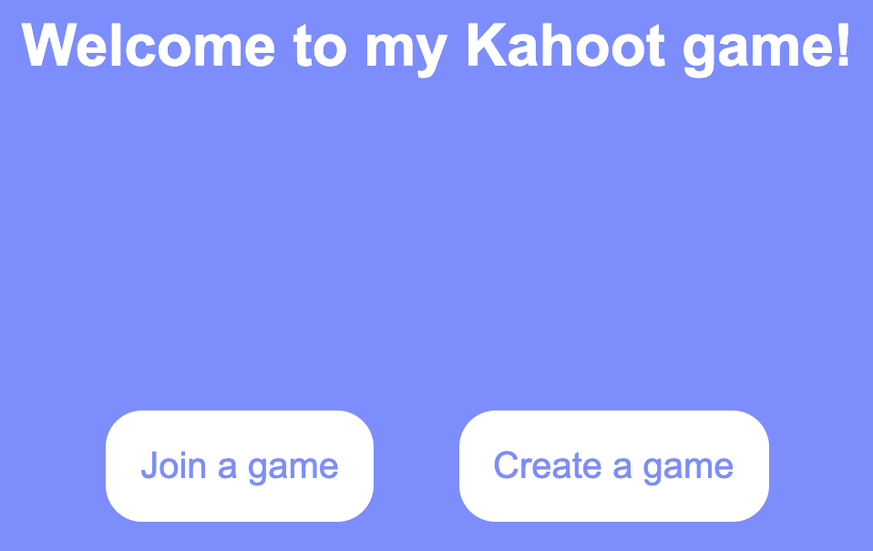
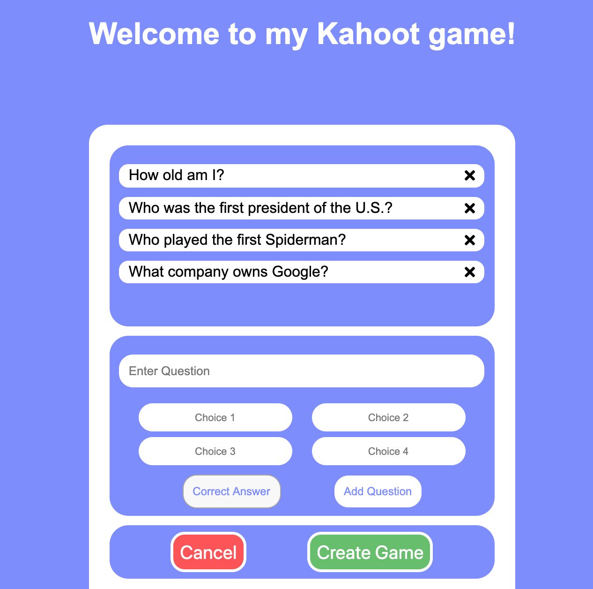
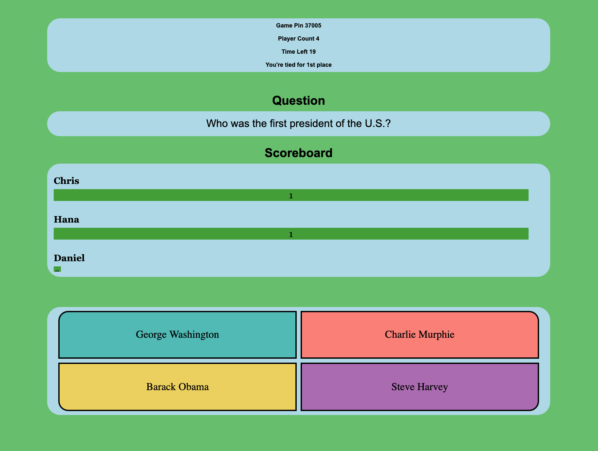
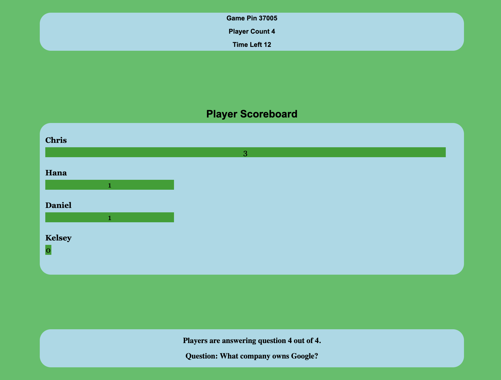

<h1 align="center"> Kahoot-Like App </h1> <br>
<p align="center">
  
</p>

<p align="center">
  This application is inspired by <a href="https://kahoot.com">Kahoot<a/>, an application mainly used by teachers to quiz their students all at once in realtime.
</p>

## Table of Contents

- [Introduction](#introduction)
- [Features](#features)
- [Setting Up](#setting-up)

## Introduction


Create games/quizzes with user-inputted questions and answers! After creating a game, a random pin is generated; Give that pin to people who will be answering the questions. The host starts the game then everyone gets a live score board to see what place they're in as users answer questions.

<table>
    <tr>
        <td>
            
        </td>
        <td>
            
        </td>
        <td>
            
        </td>
    </tr>
</table>

## Features

A few of the things you can do with this app:

* Create a game with custom questions/answers
* Host can start the game whenever they want
* Game continues if host leaves midgame
* Join a game with a unique username
* Realtime scoreboard for players and host

## Setting Up

These instructions will get you a copy of the project up and running on your local machine for development and testing purposes.

### Prerequisites

1. Create an account for MongoDB and deploy a free cluser [here](https://www.mongodb.com).

2. These have to be installed first before continuing.

	* [Angular CLI](https://angular.io/)
	* [Node](https://nodejs.org)

### Installing

Run the command below twice in the [client](/client) and [server](/server) directories.

```
npm install
```

### Config

The following variables can be changed in the [config](/client/src/app/models/config.ts) file for the client. The SERVER_ROOT variable has to be changed to your backend root server or there will be errors. The default should work if you will be hosting locally for testing/development.

```ts
export const SERVER_ROOT: string = "http://127.0.0.1:8080"; // Your backend server root url
export const animateTimer: number = 250; // Duration of fade in/out animations
export const animateTimerPage: number = 2000; // Duration of fade in/out animations for pages
export const displayStatusTimer: number = 1400; // Duration of how long user sees join statuses when joining a game
```

The following values can be changed in the [config](/server/config/default.json) file for the server. The *username* and *password* in the mongoURI property has to be changed to reflect your credentials for the database you create. The default clientRootURL property value does not need to be changed if you will be hosted locally for testing/development.

```js
{
"mongoURI": "mongodb+srv://<username>:<password>@cluster-spzis.mongodb.net/Kahoot-Like-App?retryWrites=true&w=majority",
"clientRootURL": "http://127.0.0.1:4200"
}
```

### Running Locally

Run the command below in the [client](/client) directory.

```
ng serve
```

In another terminal window, run the command below in the [server](/server) directory.

```
npm run dev
```

Now open a web browser and connect to the [link](http://127.0.0.1:4200) below.
```
http://127.0.0.1:4200
```